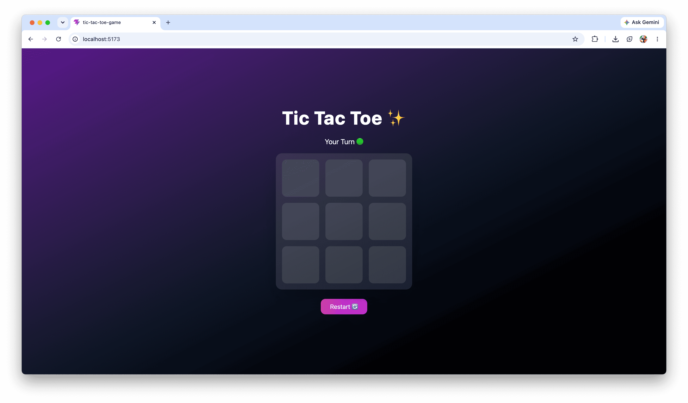
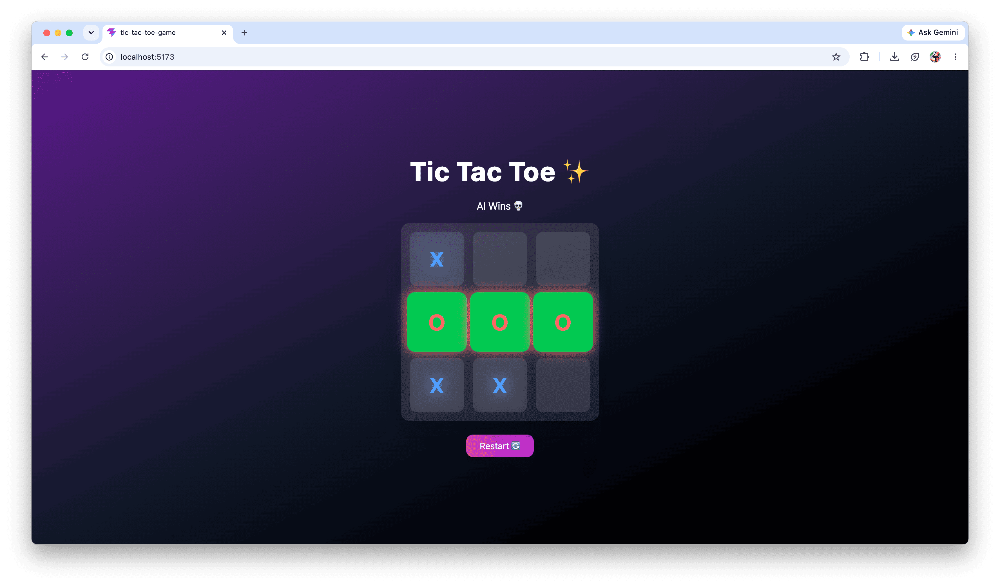
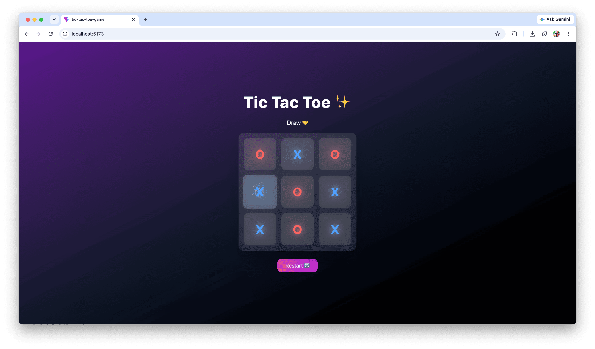

# 🎮 AI Tic Tac Toe Game (React + Minimax)

A smart and interactive Tic Tac Toe game built with React, featuring an unbeatable AI powered by the Minimax algorithm.

---

## 🚀 Live Demo

👉 https://your-live-link-here.com

---

## 🧠 Features

* 🤖 AI opponent using **Minimax Algorithm**
* 🎯 Player vs Computer gameplay
* 🏆 Automatic winner detection
* ✨ Winning cells highlight effect
* 🔄 Restart game functionality
* ⚡ Smooth animations and transitions
* 📱 Responsive and modern UI

---

## 🛠️ Tech Stack

* ⚛️ React (Hooks)
* 🎨 Tailwind CSS
* 🧠 JavaScript

---

## 📂 Project Structure

```bash
tic-tac-toe-ai/
│
├── src/
│   ├── App.jsx
│   ├── main.jsx
│
├── public/
├── index.html
└── package.json
```

---

## ⚙️ Installation & Setup

Clone the repository:

```bash
git clone https://github.com/yamini-rani17/Tic-tac-toe-game
```

Go to project folder:

```bash
cd Tic-tac-toe-game
```

Install dependencies:

```bash
npm install
```

Run the project:

```bash
npm run dev
```

---

## 🎮 How to Play

* You play as **X**
* AI plays as **O**
* Click on any empty box to make your move
* AI will respond automatically
* First to align 3 marks wins 🏆
* If all boxes fill → Draw 🤝

---

## 🧠 AI Logic (Minimax)

The game uses the **Minimax algorithm**, which ensures:

* AI always plays the best possible move
* AI is **unbeatable**
* Evaluates all possible game outcomes

---

## 📸 Screenshot






---

## 🌟 Future Improvements

* 🎚️ Difficulty levels (Easy / Medium / Hard)
* 🔊 Sound effects
* 🌐 Multiplayer mode
* 🎨 More UI themes

---

## 👩‍💻 Author

**Yamini Rani**
GitHub: (https://github.com/yamini-rani17)

---


⭐ If you like this project, give it a star!
